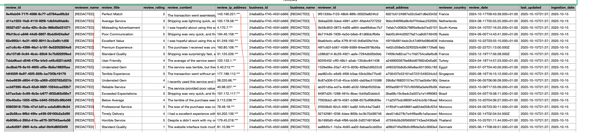
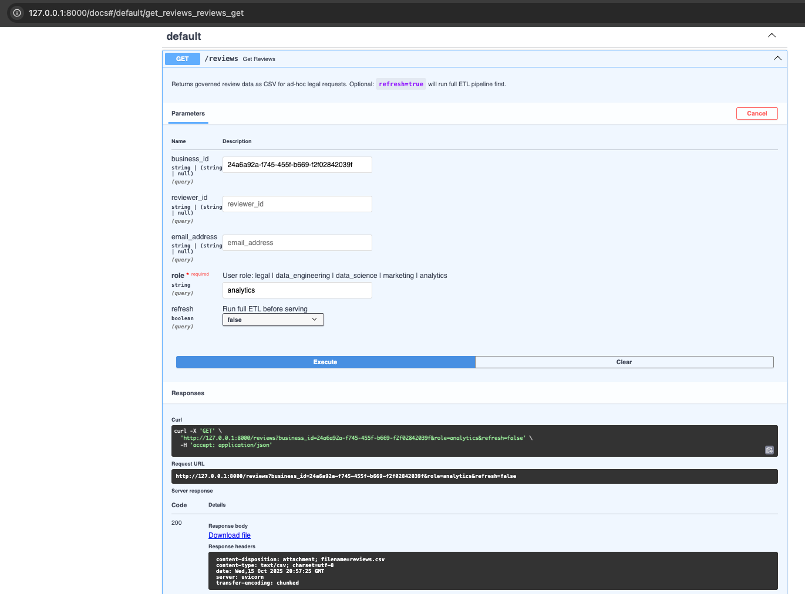

**README — Trustpilot Data Governance & Compliance API (PoC)**

This project implements a Data Governance Proof of Concept for handling Trustpilot-style review data.
It simulates how legal, analytics, data_engineering, data_science, marketing and analytics teams can request governed datasets via an API that dynamically enforces **PII masking**, **redaction**, and **role-based access control** (RBAC).

The system:

* Ingests, validates, and governs raw review data.
* Applies role-based privacy masking and redaction policies.
* Exposes a FastAPI endpoint to download filtered datasets (as CSV).
* Enables easy ad-hoc requests such as:
  * “Provide reviews for business X”
  * “Provide reviews by user Y”
  * “Provide user account information for user Z”

**Data Flow**

CSV → Spark DataFrame → Apply Data Quality Rules → Apply Governance Tags → Write Delta Table → Serve CSV via FastAPI

**Tests**
Test can be run by using `poetry run pytest tests/ -v` 

**Key Components**

| Component                   | Description                                                         |
|-----------------------------|---------------------------------------------------------------------|
| `apply_expectations()`      | Applies data quality checks from `ts_expectations.json`.            |
| `apply_governance_tags()`   | Applies role-based PII masking and redaction rules dynamically.     |
| `main.py`                   | Orchestrates ingestion, validation, and Delta writing.              |
| `api_server.py`             | FastAPI microservice to query governed Delta data and stream CSV.   |
| `data_policy_tags.py`       | Defines column-level PII tags (email, IP, etc.).                    |
| `pii_masking_rules.py`      | Maps tags to masking functions (e.g. `hash_sha256`, `redact`).      |
| `access_policy_map.py`      | Defines allowed tags per role (e.g. analytics, legal).              |
| `tests/`                    | Contains full unit and integration test suite.                      |
| --------------------------- | ------------------------------------------------------------------  |

**Environment Setup**

Prerequisites:
  Python 3.11
  Poetry 1.8+
  Spark 3.3+ (Databricks 11.3 LTS compatible)
  Java (OpenJDK 11 or later)

Resources:
  tests/resources contain resources for testing and local runs
  ts_review/api_resources contains resources for api server

Install dependencies
  poetry install
  *add dependency as required
  Please install poetry add pyspark fastapi uvicorn pandas ** it is important as part of api

**Running the setup**

  * Running integration test helps in validating the setup and different roles based access to data
    poetry run pytest tests/test_integration_main.py -v

  * To run the api server FastAPI
    `poetry run uvicorn ts_review.api_server:app --reload --port 8000`
    you will see something like `Uvicorn running on http://127.0.0.1:8000`
    * To test the api endpoint
    * Open a browser and navigate to http://127.0.0.1:8000/docs
    * You will see the interactive API documentation (Swagger UI)
      * API Usage
        * Use the `/get_reviews/` endpoint to request reviews
          GET /reviews
        * 
          | Name            | Type   | Description                                                          |
          | --------------- | ------ | -------------------------------------------------------------------- |
          | `role`          | string | User role (`analytics`, `data_engineering`, `data_science`, `legal`) |
          | `business_id`   | string | Filter reviews for a specific business                               |
          | `reviewer_id`   | string | Filter by reviewer                                                   |
          | `email_address` | string | Filter by email                                                      |
          | `refresh`       | bool   | Re-run data load if Delta is missing                                 |

    Example calls
  * for legal role which has access to all the data
    curl -o reviews.csv \
    "http://127.0.0.1:8000/reviews?role=legal"

  * For role based data access with only selected columns only visible like masking of email address, name, ip address
    curl -o reviews.csv \
    "http://127.0.0.1:8000/reviews?role=analytics&business_id=24a6a92a-f745-455f-b669-f2f02842039f"

**FASTAPI Endpoints UI**

